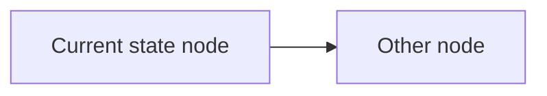
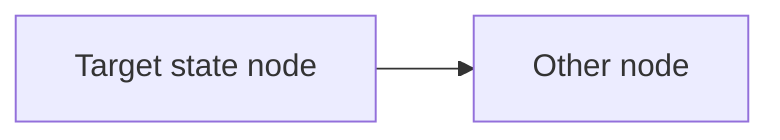

# Plan Templates

## Simple Plan Template

```markdown
# Plan: [Title]

**Date:** YYYY-MM-DD
**Status:** DRAFT | APPROVED | IN-PROGRESS | COMPLETED
**Risk Level:** Low | Medium | High

---

## Overview

[Brief description of what will be implemented]

## Goal

[What the plan achieves — one or two sentences]

## Requirements

- [Spec/requirement — behavior, constraints, acceptance criteria]

## Current State

[Optional if code is modified rather than greenfield. Describe the relevant existing implementation.]



## Target State

[Describe the end-state structure. Always include a diagram.]



## Interfaces

[For each new or changed public interface/module — full types and signatures.]

### Module / `ClassName`

```ts
// describe the module or class

// signature(s) with full types
export function foo(param: Type): ReturnType;

export interface Config {
  enabled: boolean;
  retries: number;
}
```

- **Behavior:** what it does and its [error/edge semantics]
- **Usage:** how callers invoke it

## Tasks

### Task 1: [Title]

**Description:** [What to implement]
**Files:** [List of files to modify/create]
**References:** [Interfaces/types/symbols from this plan and code locations the task depends on]
**Test:** [What to test before implementing]
**Verify:** [Command to confirm it works]

- [ ] [Specific step 1]
- [ ] [Specific step 2]

### Task 2: [Title]

[Same structure]

---

## Open Questions

- [Unresolved questions]
```

## Multi-Phase Plan Template

```markdown
# Plan: [Title]

**Date:** YYYY-MM-DD
**Status:** DRAFT | APPROVED | IN-PROGRESS | COMPLETED
**Risk Level:** Low | Medium | High

---

## Overview

[Brief description]

## Goal

[What the plan achieves — one or two sentences]

## Requirements

- [Spec/requirement — behavior, constraints, acceptance criteria]

## Current State

[Optional. Describe the relevant existing implementation.]


## Target State

[Describe the end-state structure. Always include a diagram.]


## Interfaces

[All new/changed public interfaces across the whole plan, with full types and signatures.]

### Module / `ClassName`

```ts
export function foo(param: Type): ReturnType;
```

## Phase 1: [Name]

### Phase Goal

[High-level goal of this phase — the outcome it delivers]

### Task 1.1: [Title]

**Description:** [What to implement]
**Files:** [List of files]
**References:** [Interfaces/types/symbols and code locations this task depends on]
**Test:** [What to test first]
**Verify:** [Command to run]

- [ ] [Step 1]
- [ ] [Step 2]

### Task 1.2: [Title]

[Same structure]

---

## Phase 2: [Name]

### Phase Goal

[High-level goal of this phase]

[Same structure]

---

## Dependencies

| Task | Depends On |
|------|------------|
| 1.2  | 1.1        |
| 2.1  | 1.1, 1.2   |

## Open Questions

- [Unresolved questions]
```